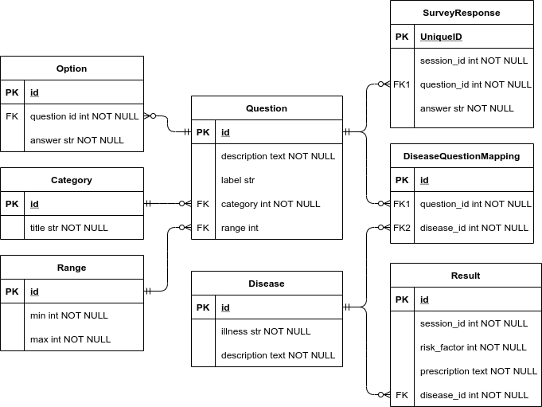

## 🔎 Risk factor analysis 

This application is a part of Doctorinna API open-source solution. The creation of this tool is motivated by the lack of solutions on the market that identify risk groups maintaining recommendation system to improve the quality of life.

### Database design
The following Entity-Relationship diagram provide an overview of database structure.

   

All of these classes implemented in the form of Data Transfer Object, meaning that for each of them created correspondent serializer used to define object representation in json format and vice versa.

There are 3 models that heavily used by the API: `Question`, `SurveyResponse`, and `Result`. The model `Question` provides information about structure of question: its options, range, what label to assign to the answer, etc. The class `SurveyResponse` aggregates answers from the user and assigns unique identifier to session. Finally, the model `Result` is used to store prediction from the ML model.    

### Django design patterns
Django REST application includes four essential components: Models, Forms, Views, and Serializers. Models are presented in models.py and describe entities stored in the database. They allow preserving data in an OOP manner. Forms are used to collect information from users. Views are controllers treating user requests and connecting business logic with the database. Serializers used to translate objects for sending to clients.

One DDP actively used in our project is CRUD Views. The idea is to logically group all actions with a set of objects in one method. Thus, we can create only one route for each model to perform `GET`, `POST`, `UPDATE`, `DELETE` requests.

Another DDP used is handling reverse relationships in the serializers. For example, consider the Question and Answer models: Answer model has auxiliary foreign key to Question as the question can have several possible options. However, when the client side requests for a list of questions, we want to send correspondent options or possible ranges. To do so, in the Answer model we defined a related name in a foreign key field, and configured Question serializer to include objects with the related name to serialization.

### Routing
|Title|Route|Supports|Purpose|
|-------|------|:------:|------|
|List of diseases|`/api/risks/diseases/`| `GET` |Used to get list of currently supported diseases, e.g. Cardiovascular disease, Stroke and Diabetes. |
|List of categories|`api/risks/categories/`|`GET` |Used to get list of categories for questions. Categories are used to logically split set of questions in topics. Requesting questions from some category greatly reduces size of transferred json objects.|
|List of questions|`/api/risks/questions/`|`GET` |Used to get list of questions for user to undergo. This set of questions designed to obtain diseases-sensitive information about the user.|
|List of questions by category| `/api/risks/questions/<category>`|`GET`|Used tot get list of questions from specific category.|
|Send user's answers|`/api/risks/response/`|`POST` `GET`| Used to send all answers from the user to API. Once the message received and deserialized, the worker invoked to inference ML models. As ML models we used Random Decision trees. The training notebooks are available [here](../../notebooks). The list of answers sent can be obtained via `GET` request.|
|Change answer|`/api/risks/response/<id>`|`PUT`|Used to change answer to the question with a given `id`.|
|Get results|`/api/risks/result/`|`GET`|Used to get risk group and recommendation for each disease.|
|Get results by disease|`/api/risks/result/specific/<disease>`|`GET`|Used to get risk group and recommendation for specified disease.|
|Get user's score|`/api/risks/result/score/`|`GET`|Used to get the abstract result of health performance in range `[0..100]`, and percentage of users who had lower result.|
|Get region statistics|`/api/risks/result/statistics/<disease>`|`GET`|Used to get statistics of user's result for this disease in different regions of Russia, and distribution of factor groups in user's region.|
